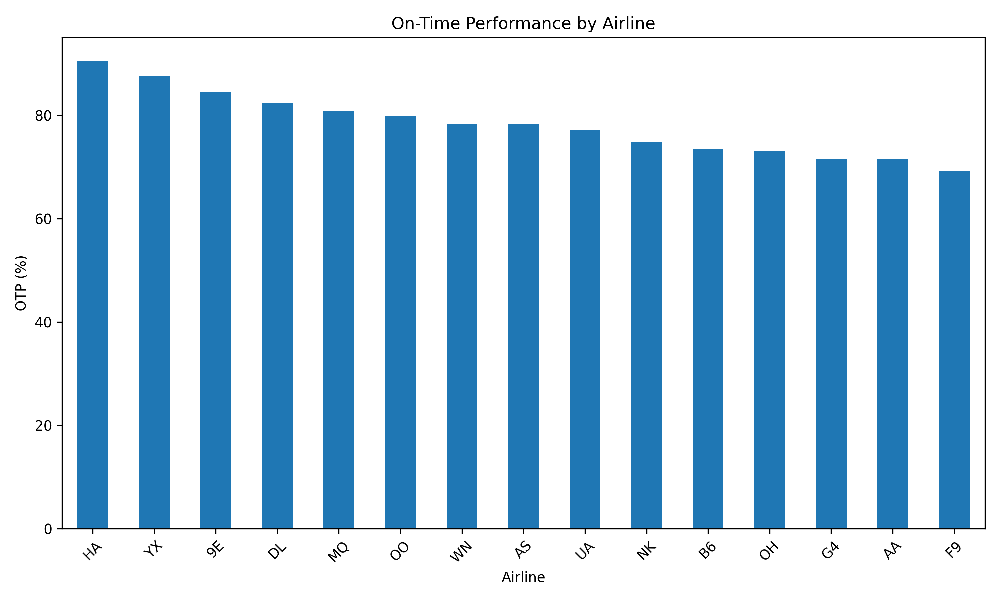

# ✈️ Airline Operations Performance Analytics

> A data-driven analysis of airline operational performance using real BTS Flight Data 2024.


---

# 📖 Project Overview

Commercial airlines operate thousands of flights every day. Operational disruptions such as delays, cancellations, and inefficient aircraft utilization can significantly increase operating costs while reducing customer satisfaction.

This project analyzes real-world flight operations data published by the **Bureau of Transportation Statistics (BTS)** to evaluate airline operational performance and identify opportunities for operational improvement.

---

# 🎯 Business Problem

**How can an airline improve its operational performance using operational flight data?**

To answer this question, the project evaluates operational KPIs, benchmarks airlines and airports, identifies the major causes of delays, and generates actionable business insights.

---

# 🎯 Project Objectives

- Evaluate airline operational performance
- Measure key operational KPIs
- Benchmark airline performance
- Benchmark airport performance
- Identify the primary causes of flight delays
- Analyze operational trends
- Generate business recommendations

---

# 📂 Dataset

**Source**

Bureau of Transportation Statistics (BTS)

Dataset:

Flight Data 2024

> **Note**
>
> The original dataset is not included in this repository because it exceeds GitHub's file size limits.

---

# 📊 Operational KPIs

This project evaluates the following metrics:

- Total Flights
- On-Time Performance (OTP)
- Average Arrival Delay
- Average Departure Delay
- Cancellation Rate
- Diversion Rate

---

# 🔍 Project Workflow

```
Business Problem
        ↓
Data Understanding
        ↓
Operational KPI Analysis
        ↓
Airline Performance Analysis
        ↓
Airport Performance Analysis
        ↓
Delay Root Cause Analysis
        ↓
Time-Based Analysis
        ↓
Business Insights
        ↓
Management Recommendations
```

---

# 📈 Analysis Performed

- Data Understanding
- Data Quality Assessment
- Operational KPI Analysis
- Airline Performance Analysis
- Airport Performance Analysis
- Delay Root Cause Analysis
- Time-Based Operational Analysis
- Executive Dashboard
- Business Recommendations

---

# 📷 Project Visualizations

## Airline On-Time Performance



---

## 💡 Key Business Insights

- Airline operational performance varies significantly across carriers.
- Carrier Delay and Late Aircraft Delay are the dominant delay sources.
- Airport performance has a measurable impact on arrival delays.
- Operational KPIs provide an effective framework for monitoring airline performance.
- Data-driven decision making can support continuous operational improvement.

---

# 🛠 Technologies

- Python
- Pandas
- NumPy
- Matplotlib
- Jupyter Notebook

---

# 📁 Repository Structure

```
flight-delay-analytics/
│
├── images/
├── notebooks/
├── data/
├── README.md
├── requirements.txt
└── .gitignore
```

---

# 🚀 Future Improvements

- Flight Delay Prediction using Machine Learning
- Interactive Power BI Dashboard
- Route Performance Analysis
- Aircraft Utilization Analysis
- Predictive Maintenance Analytics
- Real-Time Airline Operations Dashboard

---

# 👨‍💻 Author

**Ali Ajam**

Mechanical Engineering • Aviation • Data Analytics • Artificial Intelligence

GitHub:

https://github.com/aliajam9731-del

---

# ⭐ If you found this project interesting, consider giving it a star.